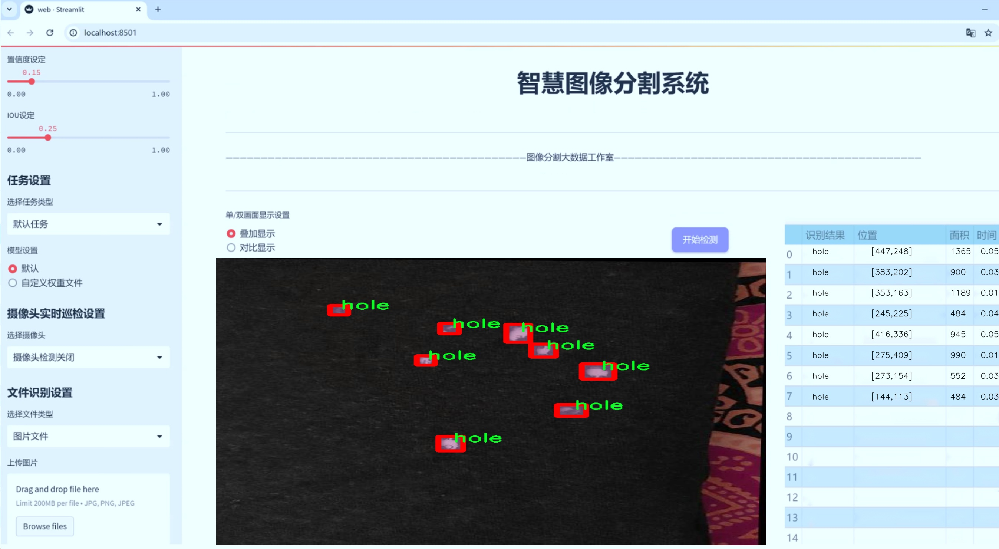
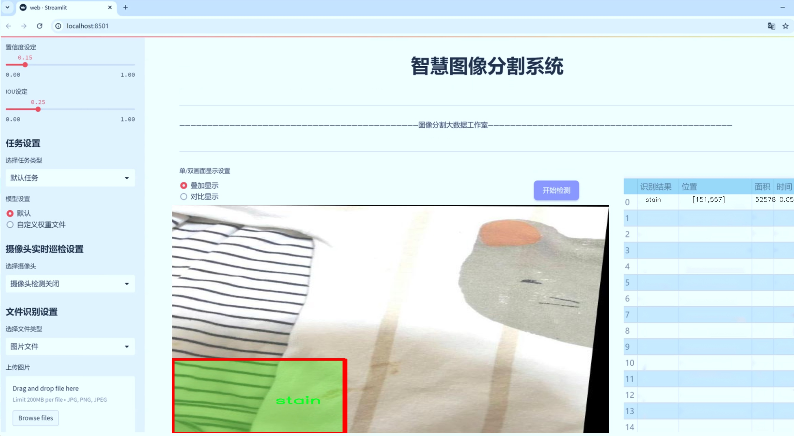
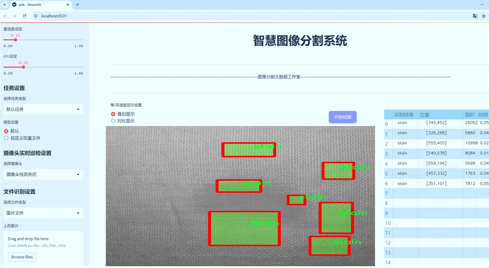
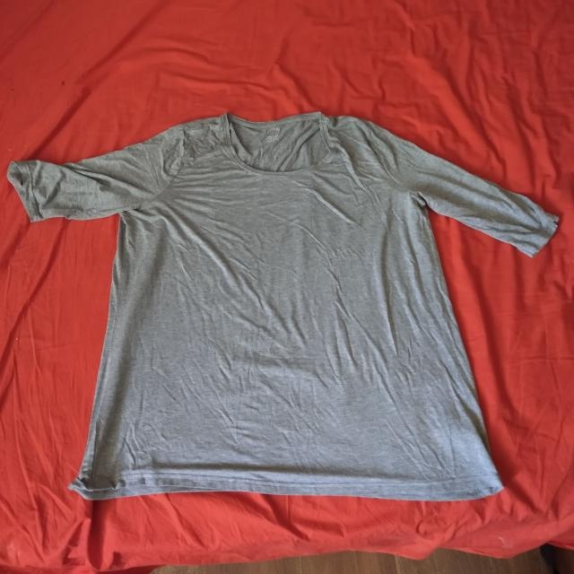
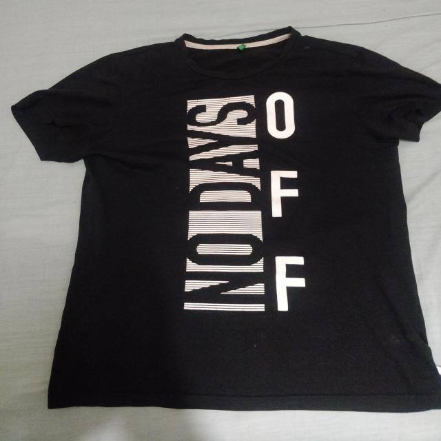
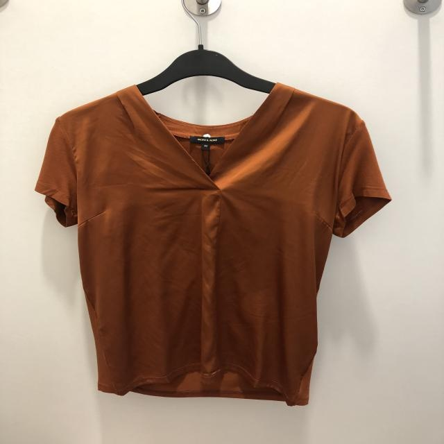
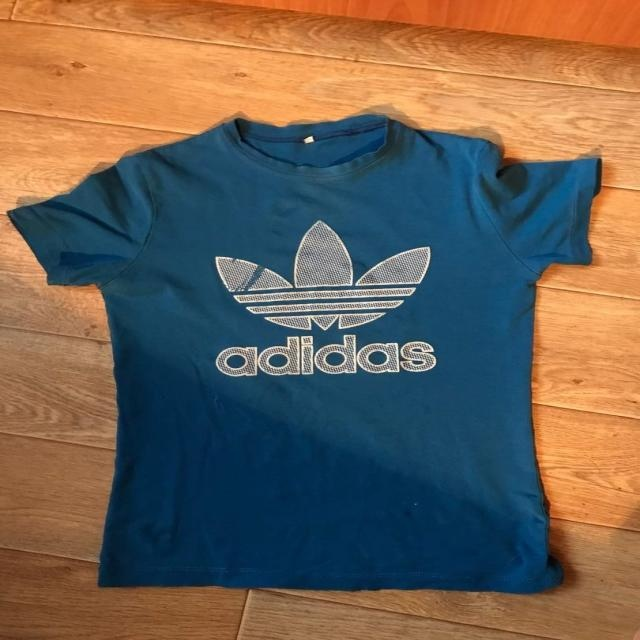
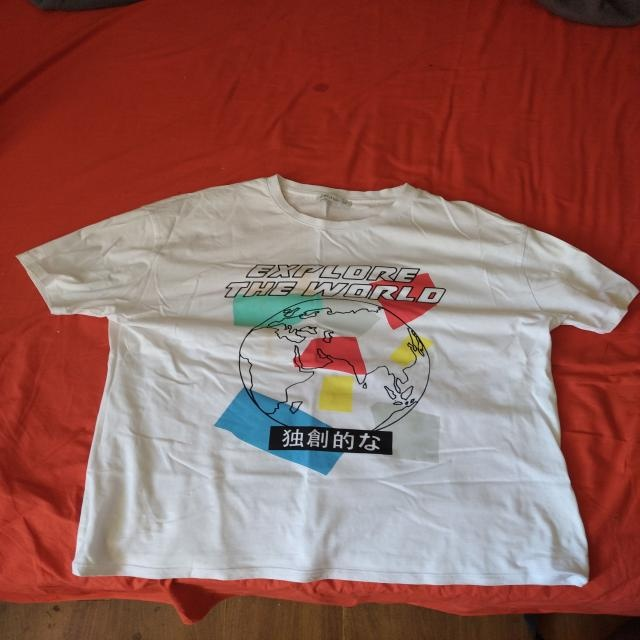

# 服装缺陷图像分割系统源码＆数据集分享
 [yolov8-seg-vanillanet＆yolov8-seg-slimneck等50+全套改进创新点发刊_一键训练教程_Web前端展示]

### 1.研究背景与意义

项目参考[ILSVRC ImageNet Large Scale Visual Recognition Challenge](https://gitee.com/YOLOv8_YOLOv11_Segmentation_Studio/projects)

项目来源[AAAI Global Al lnnovation Contest](https://kdocs.cn/l/cszuIiCKVNis)

研究背景与意义

随着时尚产业的快速发展，服装质量的控制与管理愈发重要。消费者对服装的质量要求不断提高，尤其是在快速时尚的背景下，服装缺陷的检测与修复成为了提升品牌形象和市场竞争力的关键因素。服装缺陷不仅影响消费者的购买体验，还可能导致品牌信誉的下降，进而影响企业的经济效益。因此，建立一个高效、准确的服装缺陷检测系统显得尤为重要。

近年来，深度学习技术的迅猛发展为图像处理领域带来了新的机遇，尤其是在目标检测和图像分割方面。YOLO（You Only Look Once）系列模型以其高效的实时检测能力和良好的准确性，成为了图像分割任务中的热门选择。YOLOv8作为该系列的最新版本，结合了更为先进的网络结构和训练策略，具备了更强的特征提取能力和更高的检测精度。因此，基于改进YOLOv8的服装缺陷图像分割系统的研究，不仅具有理论上的创新意义，也在实际应用中具有重要的价值。

本研究所使用的数据集“clothes defects testt”包含4500张图像，涵盖了六类常见的服装缺陷，包括孔洞、绒毛、印刷缺陷、污渍、线头和洗涤问题。这些缺陷类型的多样性为模型的训练提供了丰富的样本，有助于提高模型的泛化能力和适应性。在实际应用中，能够准确识别和分割这些缺陷，不仅可以帮助企业在生产过程中进行实时监控和质量控制，还可以为后续的缺陷修复提供数据支持。

此外，随着计算机视觉技术的不断进步，服装缺陷检测的自动化程度也在逐步提高。传统的人工检测方法不仅效率低下，而且容易受到人为因素的影响，导致检测结果的不稳定性。通过引入基于YOLOv8的图像分割系统，可以实现对服装缺陷的自动化检测，显著提高检测效率和准确性。这对于大规模生产的服装企业而言，能够有效降低人工成本，提升生产效率，从而在激烈的市场竞争中占据优势。

在学术研究方面，基于改进YOLOv8的服装缺陷图像分割系统的研究，能够为图像分割技术在特定领域的应用提供新的思路和方法。通过对模型的改进和优化，可以进一步推动深度学习在服装检测领域的应用，丰富相关的理论研究和实践经验。同时，本研究也为后续的相关研究提供了数据基础和技术支持，具有较高的学术价值。

综上所述，基于改进YOLOv8的服装缺陷图像分割系统的研究，不仅能够提升服装质量检测的效率和准确性，还能够为时尚产业的可持续发展提供技术支持，具有重要的现实意义和深远的学术价值。

### 2.图片演示







##### 注意：由于此博客编辑较早，上面“2.图片演示”和“3.视频演示”展示的系统图片或者视频可能为老版本，新版本在老版本的基础上升级如下：（实际效果以升级的新版本为准）

  （1）适配了YOLOV8的“目标检测”模型和“实例分割”模型，通过加载相应的权重（.pt）文件即可自适应加载模型。

  （2）支持“图片识别”、“视频识别”、“摄像头实时识别”三种识别模式。

  （3）支持“图片识别”、“视频识别”、“摄像头实时识别”三种识别结果保存导出，解决手动导出（容易卡顿出现爆内存）存在的问题，识别完自动保存结果并导出到tempDir中。

  （4）支持Web前端系统中的标题、背景图等自定义修改，后面提供修改教程。

  另外本项目提供训练的数据集和训练教程,暂不提供权重文件（best.pt）,需要您按照教程进行训练后实现图片演示和Web前端界面演示的效果。

### 3.视频演示

[3.1 视频演示](https://www.bilibili.com/video/BV1LPSbYqErU/)

### 4.数据集信息展示

##### 4.1 本项目数据集详细数据（类别数＆类别名）

nc: 6
names: ['hole', 'lint', 'spoiled_prints', 'stain', 'thread', 'wash']


##### 4.2 本项目数据集信息介绍

数据集信息展示

在本研究中，我们使用了名为“clothes defects testt”的数据集，以支持对YOLOv8-seg模型的训练，旨在改进服装缺陷图像分割系统。该数据集专注于服装行业中常见的缺陷类型，涵盖了六个主要类别，分别为：孔洞（hole）、绒毛（lint）、印刷缺陷（spoiled_prints）、污渍（stain）、线头（thread）和洗涤问题（wash）。这些类别不仅反映了服装在生产和使用过程中可能遇到的各种质量问题，也为图像分割算法提供了丰富的训练样本，以提高其在实际应用中的准确性和鲁棒性。

数据集的构建过程充分考虑了多样性和代表性，确保每个缺陷类别都有足够的样本量，以便模型能够学习到不同类型缺陷的特征。例如，孔洞类样本可能包括不同大小和形状的破损，而绒毛类样本则可能涉及不同颜色和材质的衣物表面。印刷缺陷则可能表现为颜色不均匀或图案模糊，这些都需要模型具备良好的分割能力，以便在实际检测中准确识别和定位。污渍类样本则可能包括油渍、泥土等多种类型的污渍，线头类样本则展示了缝合过程中可能出现的多种线头情况，而洗涤问题则涉及到洗涤后衣物表面可能出现的褪色或变形现象。

在数据集的标注过程中，采用了高标准的标注规范，确保每个样本的缺陷区域都被准确地框定和标记。这一过程不仅提高了数据集的质量，也为后续的模型训练提供了可靠的基础。通过精确的标注，YOLOv8-seg模型能够在训练过程中有效地学习到不同缺陷的特征，从而在推理阶段实现高效的图像分割。

此外，数据集还考虑到了不同光照条件和背景环境对缺陷识别的影响，样本中包含了多种拍摄条件下的图像。这种多样性使得模型在训练过程中能够更好地适应现实世界中可能遇到的各种情况，提高了其在实际应用中的适应性和准确性。通过在多种环境下的训练，模型将能够更好地处理不同类型的服装缺陷，从而为服装质量检测提供更为全面和准确的解决方案。

综上所述，“clothes defects testt”数据集为改进YOLOv8-seg的服装缺陷图像分割系统提供了坚实的基础。通过对六个缺陷类别的全面覆盖和高质量的标注，该数据集不仅增强了模型的学习能力，也为后续的研究和应用奠定了良好的基础。随着深度学习技术的不断发展，利用这样的数据集进行训练，将为服装行业的质量控制和检测提供更为高效和智能的解决方案。











### 5.全套项目环境部署视频教程（零基础手把手教学）

[5.1 环境部署教程链接（零基础手把手教学）](https://www.bilibili.com/video/BV1jG4Ve4E9t/?vd_source=bc9aec86d164b67a7004b996143742dc)


[5.2 安装Python虚拟环境创建和依赖库安装视频教程链接（零基础手把手教学）](https://www.bilibili.com/video/BV1nA4VeYEze/?vd_source=bc9aec86d164b67a7004b996143742dc)

### 6.手把手YOLOV8-seg训练视频教程（零基础小白有手就能学会）

[6.1 手把手YOLOV8-seg训练视频教程（零基础小白有手就能学会）](https://www.bilibili.com/video/BV1cA4VeYETe/?vd_source=bc9aec86d164b67a7004b996143742dc)


按照上面的训练视频教程链接加载项目提供的数据集，运行train.py即可开始训练



     Epoch   gpu_mem       box       obj       cls    labels  img_size
     1/200     0G   0.01576   0.01955  0.007536        22      1280: 100%|██████████| 849/849 [14:42<00:00,  1.04s/it]
               Class     Images     Labels          P          R     mAP@.5 mAP@.5:.95: 100%|██████████| 213/213 [01:14<00:00,  2.87it/s]
                 all       3395      17314      0.994      0.957      0.0957      0.0843

     Epoch   gpu_mem       box       obj       cls    labels  img_size
     2/200     0G   0.01578   0.01923  0.007006        22      1280: 100%|██████████| 849/849 [14:44<00:00,  1.04s/it]
               Class     Images     Labels          P          R     mAP@.5 mAP@.5:.95: 100%|██████████| 213/213 [01:12<00:00,  2.95it/s]
                 all       3395      17314      0.996      0.956      0.0957      0.0845

     Epoch   gpu_mem       box       obj       cls    labels  img_size
     3/200     0G   0.01561    0.0191  0.006895        27      1280: 100%|██████████| 849/849 [10:56<00:00,  1.29it/s]
               Class     Images     Labels          P          R     mAP@.5 mAP@.5:.95: 100%|███████   | 187/213 [00:52<00:00,  4.04it/s]
                 all       3395      17314      0.996      0.957      0.0957      0.0845


### 7.50+种全套YOLOV8-seg创新点代码加载调参视频教程（一键加载写好的改进模型的配置文件）

[7.1 50+种全套YOLOV8-seg创新点代码加载调参视频教程（一键加载写好的改进模型的配置文件）](https://www.bilibili.com/video/BV1Hw4VePEXv/?vd_source=bc9aec86d164b67a7004b996143742dc)

### 8.YOLOV8-seg图像分割算法原理

原始YOLOv8-seg算法原理

YOLOv8-seg作为2023年发布的最新目标检测与分割模型，继承并发展了YOLO系列算法的优良传统，结合了YOLOX、YOLOv6、YOLOv7及PP-YOLOE等多种先进设计理念，标志着目标检测领域的一次重要进步。该模型不仅在速度和精度上实现了新的突破，同时也在模型的灵活性和可扩展性方面做出了显著的改进。YOLOv8-seg的设计旨在为实时检测任务提供高效的解决方案，尤其是在复杂的视觉识别场景中，其出色的性能使其成为众多应用场景的首选。

YOLOv8-seg的架构由三个主要部分组成：Backbone、Neck和Head。Backbone负责特征提取，利用卷积神经网络（CNN）对输入图像进行多层次的特征学习。YOLOv8的Backbone设计借鉴了YOLOv7中的E-ELAN结构，通过跨层连接的方式增强了梯度流动，提升了特征提取的效率和效果。具体而言，Backbone通过一系列卷积层、批归一化层和激活函数（如SiLU）进行图像的下采样和特征提取，确保了模型在不同尺度下的特征表达能力。

在Backbone之后，Neck部分通过特征融合技术将不同层次的特征图进行整合，形成更为丰富的特征表示。YOLOv8-seg采用了特征金字塔网络（FPN）和路径聚合网络（PAN）结构，这种设计不仅能够有效地融合多尺度特征，还能在特征传递过程中保持信息的完整性和丰富性。通过Neck的处理，模型能够更好地理解目标的上下文信息，从而提高后续检测和分割的准确性。

Head部分是YOLOv8-seg的核心，负责将经过Neck处理的特征图转化为最终的检测结果。YOLOv8-seg采用了解耦的检测头设计，通过两个并行的卷积分支分别计算目标的回归和分类损失。这种解耦设计的优势在于可以独立优化回归和分类任务，进而提升模型的整体性能。此外，YOLOv8-seg在Loss函数的设计上也进行了创新，借鉴了PP-YOLOE的相关思想，使得模型在训练过程中能够更好地适应不同的任务需求。

值得一提的是，YOLOv8-seg不仅仅局限于目标检测，还引入了语义分割的能力，使得模型能够在识别目标的同时，对目标的精确边界进行分割。这一特性在许多实际应用中具有重要意义，例如在农业领域的苹果采摘任务中，YOLOv8-seg能够准确识别并定位苹果，同时为自动采摘机器人提供精确的分割信息，从而提高采摘效率和准确性。

在模型的设置方面，YOLOv8-seg提供了多种可调参数，如depth_factor、width_factor和ratio等。这些参数的设置可以根据具体的应用需求灵活调整，从而实现模型的深度和宽度的动态变化。例如，depth_factor的调整可以使得模型在层数上进行相应的增减，而width_factor则可以改变每层的通道数。这种灵活性使得YOLOv8-seg能够在不同的硬件环境下进行优化，满足实时检测的需求。

此外，YOLOv8-seg在训练过程中采用了数据增强和迁移学习等技术，以提高模型的泛化能力和鲁棒性。通过对训练数据进行多样化处理，模型能够更好地适应不同的场景和条件，进一步提升检测和分割的精度。YOLOv8-seg的训练过程还结合了先进的优化算法，确保模型在收敛速度和最终性能上的最佳表现。

总的来说，YOLOv8-seg作为YOLO系列的最新版本，通过创新的网络结构和灵活的参数设置，实现了目标检测与分割的高效融合。其在苹果采摘等实际应用中的成功应用，展示了YOLOv8-seg在复杂视觉任务中的强大能力和广泛适用性。随着技术的不断进步，YOLOv8-seg将为目标检测领域带来更多的可能性和机遇，推动相关应用的发展与创新。


### 9.系统功能展示（检测对象为举例，实际内容以本项目数据集为准）

图9.1.系统支持检测结果表格显示

  图9.2.系统支持置信度和IOU阈值手动调节

  图9.3.系统支持自定义加载权重文件best.pt(需要你通过步骤5中训练获得)

  图9.4.系统支持摄像头实时识别

  图9.5.系统支持图片识别

  图9.6.系统支持视频识别

  图9.7.系统支持识别结果文件自动保存

  图9.8.系统支持Excel导出检测结果数据


### 10.50+种全套YOLOV8-seg创新点原理讲解（非科班也可以轻松写刊发刊，V11版本正在科研待更新）

#### 10.1 由于篇幅限制，每个创新点的具体原理讲解就不一一展开，具体见下列网址中的创新点对应子项目的技术原理博客网址【Blog】：


[10.1 50+种全套YOLOV8-seg创新点原理讲解链接](https://gitee.com/qunmasj/good)

#### 10.2 部分改进模块原理讲解(完整的改进原理见上图和技术博客链接)【如果此小节的图加载失败可以通过CSDN或者Github搜索该博客的标题访问原始博客，原始博客图片显示正常】
### 全维动态卷积ODConv
鉴于上述讨论，我们的ODConv引入了一种多维注意机制，该机制具有并行策略，用于学习卷积核在核空间的所有四个维度上的不同注意。图提供了CondConv、DyConv和ODConv的示意性比较。

ODConv的公式：根据等式1中的符号，ODConv可定义为


 将注意力标量分配给整个卷积核。图2示出了将这四种类型的关注乘以n个卷积核的过程。原则上，这四种类型的关注是相互补充的，并且以位置、信道、滤波器和核的顺序将它们逐步乘以卷积核 
 ，使得卷积运算不同w.r.t.所有空间位置、所有输入信道、所有滤波器和输入x的所有核，提供捕获丰富上下文线索的性能保证。因此，ODConv可以显著增强CNN基本卷积运算的特征提取能力。此外，具有单个卷积核的ODConv可以与标准CondConv和DyConv竞争或优于它们，为最终模型引入的额外参数大大减少。提供了大量实验来验证这些优点。通过比较等式1和等式2，我们可以清楚地看到，ODConv是一种更广义的动态卷积。此外，当设置n=1且 所有分量均为1时，只关注滤波器方向 的ODConv将减少为：将基于输入特征的SE变量应用于卷积滤波器，然后进行卷积运算（注意原始SE（Hu等人，2018b）基于输出特征，并且用于重新校准输出特征本身）。这种SE变体是ODConv的特例。


图：将ODConv中的四种注意类型逐步乘以卷积核的示例。（a） 沿空间维度的逐位置乘法运算，（b）沿输入信道维度的逐信道乘法运算、（c）沿输出信道维度的按滤波器乘法运算，以及（d）沿卷积核空间的核维度的按核乘法运算。方法部分对符号进行了说明
实现：对于ODConv，一个关键问题是如何计算卷积核的四种关注度 。继CondConv和DyConv之后，我们还使用SE型注意力模块（Hu等人，2018b），但将多个头部作为来计算它们，其结构如图所示。具体而言，首先通过逐通道全局平均池（GAP）运算将输入压缩到具有长度的特征向量中。随后，存在完全连接（FC）层和四个头部分支。ReLU（Krizhevsky等人，2012）位于FC层之后。FC层将压缩特征向量映射到具有缩减比的低维空间（根据消融实验，我们在所有主要实验中设置 ，避免了高模型复杂度）。对于四个头部分支，每个分支都有一个输出大小如图。

### 引入ODConv的改进YOLO
参考这篇博客涵盖了引入ODConv的改进YOLOv8系统的内容，ODConv采用多维注意机制，在卷积核空间的四个维度上学习不同的注意。结合了CondConv和DyConv的优势，ODConv通过图示的四种注意类型逐步与卷积核相乘，以捕获丰富的上下文线索，提升特征提取能力。

#### ODConv结构与方法
ODConv的公式和图示展示了其关注力分配给卷积核的方式，其中四种类型的关注以位置、信道、滤波器和核的顺序逐步与卷积核相乘。这种结构保证了卷积运算不同于标准的Conv操作，能够捕获更多上下文信息，从而增强了CNN的特征提取能力。另外，单个卷积核的ODConv在性能上能够与CondConv和DyConv相竞争，并且引入的额外参数大幅减少。

ODConv的特殊之处在于其广义的动态卷积性质，同时在特定条件下（n=1且所有分量为1），它可以退化为一种特例，即只关注滤波器方向，这类似于基于输入特征的SE变体，但不同于原始SE，它基于输出特征。

#### ODConv的实现
关键问题在于如何计算卷积核的四种关注度。ODConv采用了SE型注意力模块，结合了多个头部来计算这些关注度。具体实现上，通过逐通道全局平均池运算和完全连接层，将输入压缩为特征向量，随后使用四个头部分支来计算四种不同类型的关注。这样的结构能在保持模型复杂度可控的情况下，提升了特征的表征能力。

ODConv的引入为YOLOv8带来了显著的性能提升，并且通过大量实验证明了其在特征提取方面的优越性。其结合了多维注意机制和卷积操作，为目标检测和分拣系统的提升带来了新的思路和性能突破。


### 11.项目核心源码讲解（再也不用担心看不懂代码逻辑）

#### 11.1 ultralytics\nn\backbone\SwinTransformer.py

以下是经过简化和注释的核心代码，保留了Swin Transformer的主要结构和功能。

```python
import torch
import torch.nn as nn
import torch.nn.functional as F
import numpy as np
from timm.models.layers import DropPath, to_2tuple, trunc_normal_

class Mlp(nn.Module):
    """多层感知机（MLP）模块"""
    def __init__(self, in_features, hidden_features=None, out_features=None, act_layer=nn.GELU, drop=0.):
        super().__init__()
        out_features = out_features or in_features  # 输出特征数
        hidden_features = hidden_features or in_features  # 隐藏层特征数
        self.fc1 = nn.Linear(in_features, hidden_features)  # 第一层线性变换
        self.act = act_layer()  # 激活函数
        self.fc2 = nn.Linear(hidden_features, out_features)  # 第二层线性变换
        self.drop = nn.Dropout(drop)  # Dropout层

    def forward(self, x):
        """前向传播"""
        x = self.fc1(x)  # 线性变换
        x = self.act(x)  # 激活
        x = self.drop(x)  # Dropout
        x = self.fc2(x)  # 线性变换
        x = self.drop(x)  # Dropout
        return x

def window_partition(x, window_size):
    """将输入张量分割成窗口"""
    B, H, W, C = x.shape  # 获取输入的形状
    x = x.view(B, H // window_size, window_size, W // window_size, window_size, C)  # 重塑
    windows = x.permute(0, 1, 3, 2, 4, 5).contiguous().view(-1, window_size, window_size, C)  # 交换维度并展平
    return windows

def window_reverse(windows, window_size, H, W):
    """将窗口张量合并回原始形状"""
    B = int(windows.shape[0] / (H * W / window_size / window_size))  # 计算批量大小
    x = windows.view(B, H // window_size, W // window_size, window_size, window_size, -1)  # 重塑
    x = x.permute(0, 1, 3, 2, 4, 5).contiguous().view(B, H, W, -1)  # 交换维度并展平
    return x

class WindowAttention(nn.Module):
    """窗口注意力机制模块"""
    def __init__(self, dim, window_size, num_heads, qkv_bias=True, attn_drop=0., proj_drop=0.):
        super().__init__()
        self.dim = dim
        self.window_size = window_size  # 窗口大小
        self.num_heads = num_heads  # 注意力头数
        head_dim = dim // num_heads  # 每个头的维度
        self.scale = head_dim ** -0.5  # 缩放因子

        # 相对位置偏置表
        self.relative_position_bias_table = nn.Parameter(
            torch.zeros((2 * window_size[0] - 1) * (2 * window_size[1] - 1), num_heads))

        # 计算相对位置索引
        coords_h = torch.arange(self.window_size[0])
        coords_w = torch.arange(self.window_size[1])
        coords = torch.stack(torch.meshgrid([coords_h, coords_w]))  # 生成网格坐标
        coords_flatten = torch.flatten(coords, 1)  # 展平
        relative_coords = coords_flatten[:, :, None] - coords_flatten[:, None, :]  # 计算相对坐标
        relative_coords = relative_coords.permute(1, 2, 0).contiguous()  # 交换维度
        relative_coords[:, :, 0] += self.window_size[0] - 1  # 偏移
        relative_coords[:, :, 1] += self.window_size[1] - 1
        relative_coords[:, :, 0] *= 2 * self.window_size[1] - 1
        self.register_buffer("relative_position_index", relative_coords.sum(-1))  # 注册相对位置索引

        self.qkv = nn.Linear(dim, dim * 3, bias=qkv_bias)  # QKV线性变换
        self.attn_drop = nn.Dropout(attn_drop)  # 注意力Dropout
        self.proj = nn.Linear(dim, dim)  # 输出线性变换
        self.proj_drop = nn.Dropout(proj_drop)  # 输出Dropout
        trunc_normal_(self.relative_position_bias_table, std=.02)  # 初始化相对位置偏置
        self.softmax = nn.Softmax(dim=-1)  # Softmax层

    def forward(self, x, mask=None):
        """前向传播"""
        B_, N, C = x.shape  # 获取输入形状
        qkv = self.qkv(x).reshape(B_, N, 3, self.num_heads, C // self.num_heads).permute(2, 0, 3, 1, 4)  # 计算QKV
        q, k, v = qkv[0], qkv[1], qkv[2]  # 分离Q、K、V

        q = q * self.scale  # 缩放Q
        attn = (q @ k.transpose(-2, -1))  # 计算注意力

        # 添加相对位置偏置
        relative_position_bias = self.relative_position_bias_table[self.relative_position_index.view(-1)].view(
            self.window_size[0] * self.window_size[1], self.window_size[0] * self.window_size[1], -1)
        relative_position_bias = relative_position_bias.permute(2, 0, 1).contiguous()  # 交换维度
        attn = attn + relative_position_bias.unsqueeze(0)  # 添加偏置

        attn = self.softmax(attn)  # 计算Softmax
        attn = self.attn_drop(attn)  # Dropout

        x = (attn @ v).transpose(1, 2).reshape(B_, N, C)  # 计算输出
        x = self.proj(x)  # 线性变换
        x = self.proj_drop(x)  # Dropout
        return x

class SwinTransformerBlock(nn.Module):
    """Swin Transformer块"""
    def __init__(self, dim, num_heads, window_size=7, shift_size=0, mlp_ratio=4., drop=0., attn_drop=0.):
        super().__init__()
        self.norm1 = nn.LayerNorm(dim)  # 归一化层
        self.attn = WindowAttention(dim, window_size=to_2tuple(window_size), num_heads=num_heads, attn_drop=attn_drop)  # 窗口注意力
        self.norm2 = nn.LayerNorm(dim)  # 归一化层
        mlp_hidden_dim = int(dim * mlp_ratio)  # MLP隐藏层维度
        self.mlp = Mlp(in_features=dim, hidden_features=mlp_hidden_dim)  # MLP模块

    def forward(self, x):
        """前向传播"""
        shortcut = x  # 残差连接
        x = self.norm1(x)  # 归一化
        x = self.attn(x)  # 注意力机制
        x = shortcut + x  # 残差连接
        x = x + self.mlp(self.norm2(x))  # MLP模块
        return x

class SwinTransformer(nn.Module):
    """Swin Transformer主模块"""
    def __init__(self, embed_dim=96, depths=[2, 2, 6, 2], num_heads=[3, 6, 12, 24], window_size=7):
        super().__init__()
        self.layers = nn.ModuleList()  # 存储各层
        for i_layer in range(len(depths)):
            layer = SwinTransformerBlock(
                dim=int(embed_dim * 2 ** i_layer),
                num_heads=num_heads[i_layer],
                window_size=window_size)
            self.layers.append(layer)  # 添加层

    def forward(self, x):
        """前向传播"""
        for layer in self.layers:
            x = layer(x)  # 逐层传递
        return x

def SwinTransformer_Tiny(weights=''):
    """构建Swin Transformer Tiny模型"""
    model = SwinTransformer(depths=[2, 2, 6, 2], num_heads=[3, 6, 12, 24])  # 初始化模型
    if weights:
        model.load_state_dict(torch.load(weights)['model'])  # 加载权重
    return model
```

### 代码注释说明：
1. **Mlp类**：实现了一个简单的多层感知机，包含两层线性变换和激活函数。
2. **window_partition和window_reverse**：用于将输入张量分割成窗口和将窗口合并回原始形状。
3. **WindowAttention类**：实现了窗口注意力机制，计算注意力权重并应用相对位置偏置。
4. **SwinTransformerBlock类**：实现了Swin Transformer的基本块，包含注意力机制和前馈网络。
5. **SwinTransformer类**：构建了整个Swin Transformer模型，包含多个Swin Transformer块。
6. **SwinTransformer_Tiny函数**：用于创建一个小型的Swin Transformer模型，并可选择加载预训练权重。

这个简化版本保留了模型的核心结构和功能，适合进一步研究和开发。

该文件实现了Swin Transformer模型的构建，Swin Transformer是一种基于窗口的视觉Transformer架构，主要用于图像处理任务。文件中定义了多个类和函数，构成了整个模型的基础。

首先，`Mlp`类实现了一个多层感知机（MLP），包含两个线性层和一个激活函数（默认为GELU），以及可选的Dropout层。其`forward`方法负责输入数据的前向传播。

接下来，`window_partition`和`window_reverse`函数用于将输入特征图分割成小窗口，以及将窗口合并回原始特征图。这对于Swin Transformer的窗口注意力机制至关重要。

`WindowAttention`类实现了窗口基础的多头自注意力机制（W-MSA），支持相对位置偏置。该类在`forward`方法中计算输入特征的注意力权重，并应用相应的掩码（如果提供）。

`SwinTransformerBlock`类是Swin Transformer的基本构建块，包含一个窗口注意力层和一个MLP层。它还支持窗口的循环移位，以实现跨窗口的信息交流。`forward`方法处理输入特征的规范化、窗口分割、注意力计算和特征融合。

`PatchMerging`类用于将特征图中的补丁合并，以降低空间维度。它通过线性层将四个补丁的特征合并为一个补丁的特征。

`BasicLayer`类表示Swin Transformer中的一个基本层，包含多个Swin Transformer块。它还负责计算注意力掩码，并在需要时进行下采样。

`PatchEmbed`类将输入图像划分为补丁，并通过卷积层将其嵌入到高维空间中。该类还可以选择性地应用归一化。

`SwinTransformer`类是整个模型的核心，负责构建整个Swin Transformer的结构，包括补丁嵌入、层的堆叠和输出处理。它支持绝对位置嵌入和可选的归一化层。

最后，`update_weight`函数用于更新模型的权重，从预训练模型中加载权重。`SwinTransformer_Tiny`函数则用于创建一个小型的Swin Transformer模型，并可选择性地加载权重。

整体而言，该文件实现了Swin Transformer的完整结构，提供了图像处理任务所需的各种组件和功能。

#### 11.2 ultralytics\nn\modules\utils.py

以下是代码中最核心的部分，并附上详细的中文注释：

```python
import torch
import torch.nn.functional as F

def multi_scale_deformable_attn_pytorch(value: torch.Tensor, value_spatial_shapes: torch.Tensor,
                                        sampling_locations: torch.Tensor,
                                        attention_weights: torch.Tensor) -> torch.Tensor:
    """
    多尺度可变形注意力机制。

    参数:
    - value: 输入特征图，形状为 (bs, C, num_heads, embed_dims)，
             其中 bs 是批量大小，C 是通道数，num_heads 是头数，embed_dims 是每个头的维度。
    - value_spatial_shapes: 特征图的空间形状，形状为 (num_levels, 2)，
                            每一行包含高度和宽度。
    - sampling_locations: 采样位置，形状为 (bs, num_queries, num_heads, num_levels, num_points, 2)。
    - attention_weights: 注意力权重，形状为 (bs, num_heads, num_queries, num_levels, num_points)。

    返回:
    - output: 经过多尺度可变形注意力机制处理后的输出，形状为 (bs, num_queries, num_heads * embed_dims)。
    """

    # 获取输入的维度信息
    bs, _, num_heads, embed_dims = value.shape  # bs: 批量大小, num_heads: 头数, embed_dims: 嵌入维度
    _, num_queries, _, num_levels, num_points, _ = sampling_locations.shape  # num_queries: 查询数量, num_levels: 级别数, num_points: 每个级别的点数

    # 将输入特征图按照空间形状进行分割
    value_list = value.split([H_ * W_ for H_, W_ in value_spatial_shapes], dim=1)
    
    # 将采样位置转换到[-1, 1]范围
    sampling_grids = 2 * sampling_locations - 1
    sampling_value_list = []

    # 遍历每个级别的特征图
    for level, (H_, W_) in enumerate(value_spatial_shapes):
        # 将特征图调整形状以便进行采样
        value_l_ = (value_list[level].flatten(2).transpose(1, 2).reshape(bs * num_heads, embed_dims, H_, W_))
        
        # 获取当前级别的采样网格
        sampling_grid_l_ = sampling_grids[:, :, :, level].transpose(1, 2).flatten(0, 1)
        
        # 使用双线性插值进行特征图的采样
        sampling_value_l_ = F.grid_sample(value_l_,
                                          sampling_grid_l_,
                                          mode='bilinear',
                                          padding_mode='zeros',
                                          align_corners=False)
        sampling_value_list.append(sampling_value_l_)

    # 调整注意力权重的形状以便进行加权求和
    attention_weights = attention_weights.transpose(1, 2).reshape(bs * num_heads, 1, num_queries,
                                                                  num_levels * num_points)
    
    # 计算输出结果，通过对采样值和注意力权重进行加权求和
    output = ((torch.stack(sampling_value_list, dim=-2).flatten(-2) * attention_weights).sum(-1).view(
        bs, num_heads * embed_dims, num_queries))
    
    # 返回最终的输出，调整形状为 (bs, num_queries, num_heads * embed_dims)
    return output.transpose(1, 2).contiguous()
```

### 代码说明：
1. **多尺度可变形注意力机制**：该函数实现了多尺度可变形注意力机制，能够根据输入特征图和采样位置进行特征的加权聚合。
2. **输入参数**：
   - `value`：输入特征图，包含多个头的嵌入表示。
   - `value_spatial_shapes`：特征图的空间形状，用于分割特征图。
   - `sampling_locations`：用于采样的空间位置。
   - `attention_weights`：计算得到的注意力权重。
3. **输出**：返回经过注意力机制处理后的特征表示，形状为 `(bs, num_queries, num_heads * embed_dims)`。

这个程序文件是Ultralytics YOLO（You Only Look Once）项目的一部分，主要包含了一些实用的函数和模块，主要用于深度学习模型中的多尺度可变形注意力机制和其他相关的初始化方法。

首先，文件中导入了一些必要的库，包括`copy`、`math`、`numpy`和`torch`等。`torch`是PyTorch深度学习框架的核心库，提供了张量操作和神经网络模块的支持。

文件定义了几个函数。`_get_clones(module, n)`函数用于克隆给定的模块，返回一个包含n个克隆模块的列表。这在构建具有多个相同层的网络时非常有用。

`bias_init_with_prob(prior_prob=0.01)`函数用于根据给定的概率值初始化卷积或全连接层的偏置值。它通过计算负对数几率来返回偏置的初始值，这样可以在训练时更好地控制输出的概率分布。

`linear_init_(module)`函数用于初始化线性模块的权重和偏置。它使用均匀分布在一个特定的范围内对权重进行初始化，确保权重的初始值不会过大或过小，从而有助于模型的收敛。

`inverse_sigmoid(x, eps=1e-5)`函数计算张量的反sigmoid函数。它首先将输入值限制在0到1之间，然后计算反sigmoid值，这在某些情况下可以用于梯度计算或其他数学操作。

`multi_scale_deformable_attn_pytorch`函数实现了多尺度可变形注意力机制。该函数接收多个参数，包括值张量、空间形状、采样位置和注意力权重。它首先获取输入的形状信息，然后将值张量按照空间形状进行分割。接着，计算采样网格并对每个尺度的值进行采样，使用双线性插值方法。最后，函数将所有采样值和注意力权重结合起来，输出最终的注意力结果。

整体来看，这个文件的主要功能是提供一些深度学习模型中常用的初始化方法和多尺度注意力机制的实现，旨在提高模型的性能和灵活性。

#### 11.3 ultralytics\models\rtdetr\__init__.py

以下是保留的核心代码部分，并附上详细的中文注释：

```python
# 导入必要的模块和类
from .model import RTDETR  # 从当前包中导入 RTDETR 模型类
from .predict import RTDETRPredictor  # 从当前包中导入 RTDETR 预测器类
from .val import RTDETRValidator  # 从当前包中导入 RTDETR 验证器类

# 定义模块的公开接口
__all__ = 'RTDETRPredictor', 'RTDETRValidator', 'RTDETR'  # 指定在使用 'from module import *' 时，允许导入的类
```

### 注释说明：
1. **导入模块**：
   - `from .model import RTDETR`：导入 `RTDETR` 模型类，该类可能包含模型的定义和结构。
   - `from .predict import RTDETRPredictor`：导入 `RTDETRPredictor` 类，该类负责对输入数据进行预测。
   - `from .val import RTDETRValidator`：导入 `RTDETRValidator` 类，该类用于验证模型的性能和准确性。

2. **定义公开接口**：
   - `__all__` 是一个特殊变量，用于定义当使用 `from module import *` 时，哪些名称是可以被导入的。在这里，只有 `RTDETRPredictor`、`RTDETRValidator` 和 `RTDETR` 这三个类可以被导入，其他未列出的名称将不会被导入。这有助于控制模块的公共 API，避免不必要的名称冲突。

这个程序文件是一个Python模块的初始化文件，文件名为`__init__.py`，它位于`ultralytics\models\rtdetr`目录下。这个文件的主要作用是定义模块的公共接口，允许其他模块或包通过导入这个包时访问其中的类和函数。

在文件的开头，有一行注释`# Ultralytics YOLO 🚀, AGPL-3.0 license`，这表明该代码属于Ultralytics YOLO项目，并且遵循AGPL-3.0许可证。这种许可证通常用于开源软件，允许用户自由使用、修改和分发代码，但要求任何分发的修改版本也必须在相同的许可证下发布。

接下来，文件通过`from .model import RTDETR`导入了`model`模块中的`RTDETR`类。这个类可能是与RTDETR（Real-Time Detection Transformer）相关的核心模型，负责实现目标检测的主要功能。

然后，文件通过`from .predict import RTDETRPredictor`导入了`predict`模块中的`RTDETRPredictor`类。这个类可能用于处理模型的预测功能，负责将输入数据传递给RTDETR模型并获取预测结果。

接着，文件通过`from .val import RTDETRValidator`导入了`val`模块中的`RTDETRValidator`类。这个类可能用于模型的验证过程，帮助评估模型在测试集上的性能。

最后，`__all__`变量被定义为一个元组，包含了三个字符串：`'RTDETRPredictor'`、`'RTDETRValidator'`和`'RTDETR'`。这个变量的作用是指定当使用`from <module> import *`语句时，哪些名称会被导入。这是一种控制模块接口的方式，确保只有特定的类和函数对外可见。

总的来说，这个`__init__.py`文件为RTDETR模块提供了一个清晰的接口，方便用户导入和使用其中的功能。

#### 11.4 ultralytics\models\yolo\classify\__init__.py

```python
# 导入Ultralytics YOLO模型的分类模块
# 该模块包含了分类预测、训练和验证的功能

# 从分类预测模块导入ClassificationPredictor类
from ultralytics.models.yolo.classify.predict import ClassificationPredictor

# 从分类训练模块导入ClassificationTrainer类
from ultralytics.models.yolo.classify.train import ClassificationTrainer

# 从分类验证模块导入ClassificationValidator类
from ultralytics.models.yolo.classify.val import ClassificationValidator

# 定义模块的公开接口，允许外部使用这些类
__all__ = 'ClassificationPredictor', 'ClassificationTrainer', 'ClassificationValidator'
```

### 代码核心部分说明：
1. **导入模块**：代码中导入了三个核心类，分别用于分类预测、训练和验证。这些类是实现YOLO模型分类功能的基础。
2. **公开接口**：`__all__`变量定义了模块的公开接口，指定了哪些类可以被外部访问。这有助于封装和管理模块的使用。

这个程序文件是Ultralytics YOLO模型的一部分，主要用于分类任务。文件的开头包含了版权信息，表明该代码遵循AGPL-3.0许可证。接下来，文件通过导入语句引入了三个主要的类：`ClassificationPredictor`、`ClassificationTrainer`和`ClassificationValidator`。这些类分别负责分类任务中的预测、训练和验证功能。

`ClassificationPredictor`类用于进行图像分类的预测，能够处理输入数据并输出分类结果。`ClassificationTrainer`类则负责模型的训练过程，包括数据加载、模型优化等操作。最后，`ClassificationValidator`类用于验证训练好的模型的性能，通常会在训练完成后进行，以评估模型在未见数据上的表现。

文件的最后一行定义了`__all__`变量，这个变量指定了当使用`from module import *`语句时，应该导入的类。这种做法有助于控制模块的公共接口，确保只暴露必要的部分给外部使用者。总的来说，这个文件是Ultralytics YOLO分类模块的入口，整合了分类相关的功能模块。

#### 11.5 ultralytics\utils\callbacks\neptune.py

以下是代码中最核心的部分，并附上详细的中文注释：

```python
# 尝试导入必要的库并进行初始化
try:
    assert not TESTS_RUNNING  # 确保当前不是在运行测试
    assert SETTINGS['neptune'] is True  # 确保Neptune集成已启用
    import neptune
    from neptune.types import File

    assert hasattr(neptune, '__version__')  # 确保neptune库有版本属性

    run = None  # NeptuneAI实验记录实例

except (ImportError, AssertionError):
    neptune = None  # 如果导入失败或断言失败，则neptune为None


def _log_scalars(scalars, step=0):
    """将标量数据记录到NeptuneAI实验记录器中。"""
    if run:  # 如果NeptuneAI实例已初始化
        for k, v in scalars.items():  # 遍历标量字典
            run[k].append(value=v, step=step)  # 记录每个标量


def _log_images(imgs_dict, group=''):
    """将图像记录到NeptuneAI实验记录器中。"""
    if run:  # 如果NeptuneAI实例已初始化
        for k, v in imgs_dict.items():  # 遍历图像字典
            run[f'{group}/{k}'].upload(File(v))  # 上传每个图像文件


def on_pretrain_routine_start(trainer):
    """在训练例程开始之前调用的回调函数。"""
    try:
        global run
        # 初始化Neptune运行实例
        run = neptune.init_run(project=trainer.args.project or 'YOLOv8', name=trainer.args.name, tags=['YOLOv8'])
        # 记录超参数配置
        run['Configuration/Hyperparameters'] = {k: '' if v is None else v for k, v in vars(trainer.args).items()}
    except Exception as e:
        LOGGER.warning(f'WARNING ⚠️ NeptuneAI安装但未正确初始化，未记录此运行。 {e}')


def on_train_epoch_end(trainer):
    """每个训练周期结束时调用的回调函数。"""
    # 记录训练损失和学习率
    _log_scalars(trainer.label_loss_items(trainer.tloss, prefix='train'), trainer.epoch + 1)
    _log_scalars(trainer.lr, trainer.epoch + 1)
    if trainer.epoch == 1:  # 在第一个周期结束时记录图像
        _log_images({f.stem: str(f) for f in trainer.save_dir.glob('train_batch*.jpg')}, 'Mosaic')


def on_train_end(trainer):
    """训练结束时调用的回调函数。"""
    if run:  # 如果NeptuneAI实例已初始化
        # 记录最终结果和混淆矩阵
        files = [
            'results.png', 'confusion_matrix.png', 'confusion_matrix_normalized.png',
            *(f'{x}_curve.png' for x in ('F1', 'PR', 'P', 'R'))]
        files = [(trainer.save_dir / f) for f in files if (trainer.save_dir / f).exists()]  # 过滤存在的文件
        for f in files:
            _log_plot(title=f.stem, plot_path=f)  # 记录每个图表
        # 记录最终模型
        run[f'weights/{trainer.args.name or trainer.args.task}/{str(trainer.best.name)}'].upload(File(str(trainer.best)))


# 定义回调函数字典，如果neptune未初始化则为空
callbacks = {
    'on_pretrain_routine_start': on_pretrain_routine_start,
    'on_train_epoch_end': on_train_epoch_end,
    'on_fit_epoch_end': on_fit_epoch_end,
    'on_val_end': on_val_end,
    'on_train_end': on_train_end} if neptune else {}
```

### 代码说明：
1. **导入和初始化**：尝试导入`neptune`库并进行必要的初始化。如果导入失败，则将`neptune`设置为`None`。
2. **记录标量和图像**：定义了两个核心函数`_log_scalars`和`_log_images`，用于将训练过程中的标量数据和图像上传到Neptune。
3. **回调函数**：定义了一系列回调函数，如`on_pretrain_routine_start`、`on_train_epoch_end`和`on_train_end`，用于在训练的不同阶段记录数据。
4. **回调字典**：将回调函数存储在字典中，以便在训练过程中调用。

这个程序文件的主要功能是将训练过程中的各种数据和结果记录到NeptuneAI平台上，以便进行实验管理和可视化。文件首先导入了一些必要的模块和设置，包括日志记录器、设置参数和测试状态。接着，它尝试导入Neptune库，并进行一些基本的检查，确保在进行实验记录时，Neptune的集成是启用的。如果导入失败或条件不满足，则将`neptune`设置为`None`，以避免后续代码中的错误。

文件中定义了一些私有函数，用于记录不同类型的数据。`_log_scalars`函数用于记录标量数据，比如损失值和学习率；`_log_images`函数用于记录图像数据，例如训练过程中的图像；`_log_plot`函数用于记录绘图数据，接收绘图的标题和路径，并将其上传到Neptune。

在训练的不同阶段，文件定义了一些回调函数。这些回调函数会在特定的训练事件发生时被调用。例如，`on_pretrain_routine_start`函数在训练开始前被调用，用于初始化Neptune的实验记录，并记录超参数配置；`on_train_epoch_end`函数在每个训练周期结束时被调用，记录当前的损失和学习率，并在第一个周期结束时记录训练图像；`on_fit_epoch_end`函数在每个训练和验证周期结束时被调用，记录模型的配置信息和指标；`on_val_end`函数在验证结束时被调用，记录验证图像；`on_train_end`函数在训练结束时被调用，记录最终的结果和模型权重。

最后，文件创建了一个回调字典，将上述回调函数与相应的事件关联起来。如果Neptune未成功导入，则该字典将为空。这种设计使得代码在没有Neptune支持的情况下仍然可以正常运行，而不会导致错误。

### 12.系统整体结构（节选）

### 程序整体功能和构架概括

该程序是Ultralytics YOLO项目的一部分，主要用于目标检测和图像分类任务。程序的整体架构由多个模块组成，每个模块负责特定的功能。核心模块包括模型构建、训练、验证和实验管理。具体来说，程序实现了Swin Transformer模型的构建和多尺度注意力机制，提供了分类和目标检测的相关功能，并集成了NeptuneAI用于实验的可视化和管理。

### 文件功能整理表

| 文件路径                                      | 功能描述                                                                                   |
|-------------------------------------------|----------------------------------------------------------------------------------------|
| `ultralytics/nn/backbone/SwinTransformer.py` | 实现Swin Transformer模型的构建，包括多层感知机、窗口注意力机制、特征图分割与合并等功能。                     |
| `ultralytics/nn/modules/utils.py`          | 提供深度学习模型中常用的初始化方法和多尺度可变形注意力机制的实现，支持模型的权重初始化和功能模块的克隆。       |
| `ultralytics/models/rtdetr/__init__.py`    | 定义RTDETR模块的公共接口，导入核心类（如RTDETR、RTDETRPredictor、RTDETRValidator），便于外部使用。       |
| `ultralytics/models/yolo/classify/__init__.py` | 定义YOLO分类模块的公共接口，导入分类相关的核心类（如ClassificationPredictor、ClassificationTrainer、ClassificationValidator）。 |
| `ultralytics/utils/callbacks/neptune.py`   | 集成NeptuneAI用于记录训练过程中的数据和结果，定义回调函数以在训练的不同阶段记录超参数、损失、图像等信息。   |

这个表格总结了每个文件的主要功能，展示了Ultralytics YOLO项目的模块化设计和各个部分之间的关系。

注意：由于此博客编辑较早，上面“11.项目核心源码讲解（再也不用担心看不懂代码逻辑）”中部分代码可能会优化升级，仅供参考学习，完整“训练源码”、“Web前端界面”和“50+种创新点源码”以“14.完整训练+Web前端界面+50+种创新点源码、数据集获取”的内容为准。

### 13.图片、视频、摄像头图像分割Demo(去除WebUI)代码

在这个博客小节中，我们将讨论如何在不使用WebUI的情况下，实现图像分割模型的使用。本项目代码已经优化整合，方便用户将分割功能嵌入自己的项目中。
核心功能包括图片、视频、摄像头图像的分割，ROI区域的轮廓提取、类别分类、周长计算、面积计算、圆度计算以及颜色提取等。
这些功能提供了良好的二次开发基础。

### 核心代码解读

以下是主要代码片段，我们会为每一块代码进行详细的批注解释：

```python
import random
import cv2
import numpy as np
from PIL import ImageFont, ImageDraw, Image
from hashlib import md5
from model import Web_Detector
from chinese_name_list import Label_list

# 根据名称生成颜色
def generate_color_based_on_name(name):
    ......

# 计算多边形面积
def calculate_polygon_area(points):
    return cv2.contourArea(points.astype(np.float32))

...
# 绘制中文标签
def draw_with_chinese(image, text, position, font_size=20, color=(255, 0, 0)):
    image_pil = Image.fromarray(cv2.cvtColor(image, cv2.COLOR_BGR2RGB))
    draw = ImageDraw.Draw(image_pil)
    font = ImageFont.truetype("simsun.ttc", font_size, encoding="unic")
    draw.text(position, text, font=font, fill=color)
    return cv2.cvtColor(np.array(image_pil), cv2.COLOR_RGB2BGR)

# 动态调整参数
def adjust_parameter(image_size, base_size=1000):
    max_size = max(image_size)
    return max_size / base_size

# 绘制检测结果
def draw_detections(image, info, alpha=0.2):
    name, bbox, conf, cls_id, mask = info['class_name'], info['bbox'], info['score'], info['class_id'], info['mask']
    adjust_param = adjust_parameter(image.shape[:2])
    spacing = int(20 * adjust_param)

    if mask is None:
        x1, y1, x2, y2 = bbox
        aim_frame_area = (x2 - x1) * (y2 - y1)
        cv2.rectangle(image, (x1, y1), (x2, y2), color=(0, 0, 255), thickness=int(3 * adjust_param))
        image = draw_with_chinese(image, name, (x1, y1 - int(30 * adjust_param)), font_size=int(35 * adjust_param))
        y_offset = int(50 * adjust_param)  # 类别名称上方绘制，其下方留出空间
    else:
        mask_points = np.concatenate(mask)
        aim_frame_area = calculate_polygon_area(mask_points)
        mask_color = generate_color_based_on_name(name)
        try:
            overlay = image.copy()
            cv2.fillPoly(overlay, [mask_points.astype(np.int32)], mask_color)
            image = cv2.addWeighted(overlay, 0.3, image, 0.7, 0)
            cv2.drawContours(image, [mask_points.astype(np.int32)], -1, (0, 0, 255), thickness=int(8 * adjust_param))

            # 计算面积、周长、圆度
            area = cv2.contourArea(mask_points.astype(np.int32))
            perimeter = cv2.arcLength(mask_points.astype(np.int32), True)
            ......

            # 计算色彩
            mask = np.zeros(image.shape[:2], dtype=np.uint8)
            cv2.drawContours(mask, [mask_points.astype(np.int32)], -1, 255, -1)
            color_points = cv2.findNonZero(mask)
            ......

            # 绘制类别名称
            x, y = np.min(mask_points, axis=0).astype(int)
            image = draw_with_chinese(image, name, (x, y - int(30 * adjust_param)), font_size=int(35 * adjust_param))
            y_offset = int(50 * adjust_param)

            # 绘制面积、周长、圆度和色彩值
            metrics = [("Area", area), ("Perimeter", perimeter), ("Circularity", circularity), ("Color", color_str)]
            for idx, (metric_name, metric_value) in enumerate(metrics):
                ......

    return image, aim_frame_area

# 处理每帧图像
def process_frame(model, image):
    pre_img = model.preprocess(image)
    pred = model.predict(pre_img)
    det = pred[0] if det is not None and len(det)
    if det:
        det_info = model.postprocess(pred)
        for info in det_info:
            image, _ = draw_detections(image, info)
    return image

if __name__ == "__main__":
    cls_name = Label_list
    model = Web_Detector()
    model.load_model("./weights/yolov8s-seg.pt")

    # 摄像头实时处理
    cap = cv2.VideoCapture(0)
    while cap.isOpened():
        ret, frame = cap.read()
        if not ret:
            break
        ......

    # 图片处理
    image_path = './icon/OIP.jpg'
    image = cv2.imread(image_path)
    if image is not None:
        processed_image = process_frame(model, image)
        ......

    # 视频处理
    video_path = ''  # 输入视频的路径
    cap = cv2.VideoCapture(video_path)
    while cap.isOpened():
        ret, frame = cap.read()
        ......
```


### 14.完整训练+Web前端界面+50+种创新点源码、数据集获取


# [下载链接：https://mbd.pub/o/bread/Zp6XmZZx](https://mbd.pub/o/bread/Zp6XmZZx)